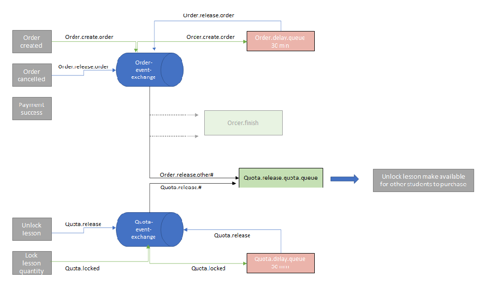

# RabbitMQ_democode
To share a piece of code

##1. Code Design
####1) Objective
There is a quota of 100 students per lesson. Therefore using message queue to manage quota available to purchase.  
Upon placing an order, a quota lock will be placed for 30 mins.
If payment made within this time, lesson will be deducted successfully.
If payment is not made, lesson quota will be open up for everyone to purchase.  

Need to ensure Order Module, and Stock Module is called upon correctly to manage the right order corresponding to the right stock.

####2) Code Logic
##### A) Order placed, prepare a delay queue of 30 mins to release order

#####B) Order placed, lesson quota will be locked for 30 mins also, and a delay queue will be triggered to release quota after 50 mins

#####C) 30 mins time limit reached, order.delay.queue will trigger
######C1) if order status paid, nothing happens
######C2) if order status unpaid, trigger message order.release to release stock

#####D) 50 mins reached, no matter what a stock delay message will be triggered
This is to prevent situations where due to network events or other scenarios, trigger from (C) did not arrive to StockService to release lesson quota, therefore a final check to verify lesson is released and made available to others if not purchased.
######D1) If stock released previously, nothing happens
######D2) If stock is still locked, release stock 

